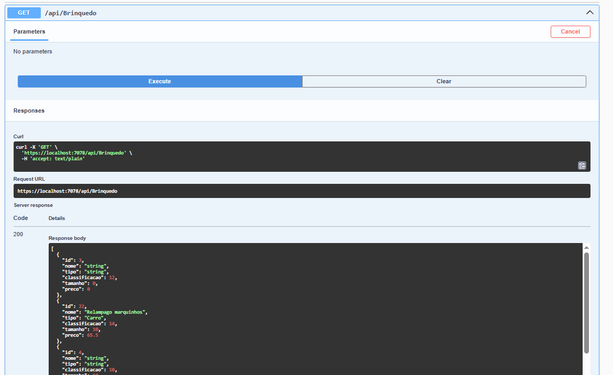

# ToysCompany

API REST para cadastro e gerenciamento de brinquedos.

## Funcionalidades
- Cadastro, edição, listagem e remoção de brinquedos
- Estrutura organizada em Controllers, Models, DTO, Services e Context
- Persistência de dados com Entity Framework Core

## Como rodar
1. Clonar o repositório
```bash
git clone https://github.com/MUKINH4/ToysCompany.git
```
2. Configure o banco em `appsettings.json`
3. Instale dependências: `dotnet restore`
4. Execute: `dotnet run`

## Estrutura de Pastas
```
ToysCompany/
├── appsettings.Development.json
├── appsettings.json
├── Program.cs
├── ToysCompany.csproj
├── ToysCompany.csproj.user
├── ToysCompany.http
├── Context/
│   └── BrinquedoDbContext.cs
├── Controllers/
│   └── BrinquedoController.cs
├── DTO/
│   └── BrinquedoDTO.cs
├── Migrations/
│   ├── 20250828190638_InitialCreate.cs
│   ├── 20250828190638_InitialCreate.Designer.cs
│   └── BrinquedoDbContextModelSnapshot.cs
├── Models/
│   └── Brinquedo.cs
├── Properties/
│   └── launchSettings.json
├── Services/
│   └── BrinquedoService.cs
```


## Endpoints principais

- **GET /api/Brinquedo**: Lista todos os brinquedos
- **GET /api/Brinquedo/{id}**: Busca brinquedo por ID
- **POST /api/Brinquedo**: Cadastra novo brinquedo
- **PUT /api/Brinquedo/{id}**: Edita brinquedo existente
- **DELETE /api/Brinquedo/{id}**: Remove brinquedo

## Exemplo de JSON para cadastro (POST /api/Brinquedo)
```json
{
  "nome": "Carrinho",
  "tipo": "Veículo",
  "classificacao": 14,
  "tamanho": 25.5,
  "preco": 99.9
}
```

## Exemplo de resposta de listagem (GET /api/Brinquedo)
```json
[
  {
    "id": 3,
    "nome": "Hot Wheels",
    "tipo": "Carrinho de Brinquedo",
    "classificacao": 14,
    "tamanho": 5,
    "preco": 59.9
  },
  {
    "id": 22,
    "nome": "Relampago marquinhos",
    "tipo": "Carro",
    "classificacao": 14,
    "tamanho": 10,
    "preco": 65.5
  }
]
```

## Exemplo de resposta de listagem com ID (GET /api/Brinquedo/3)
```json
{
  "id": 3,
  "nome": "Hot Wheels",
  "tipo": "Carrinho de Brinquedo",
  "classificacao": 14,
  "tamanho": 5,
  "preco": 59.9
}
```


## Exemplo de requisição de edição (PUT /api/Brinquedo/4)
```json
{
  "nome": "Boneca",
  "tipo": "Boneca",
  "classificacao": 14,
  "tamanho": 30.0,
  "preco": 120.00
}
```

## Exemplo de requisição de remoção (DELETE /api/Brinquedo/3)
Sem corpo. Apenas envie o método DELETE para o endpoint com o ID desejado.

# Os endpoints podem ser testados via Postman ou Swagger

## Postman
- Basta acessar a api via e usar os verbos HTTP: http://localhost:5288/api/Brinquedo

## Swagger
- Basta acessar https://localhost:7078/swagger/index.html





